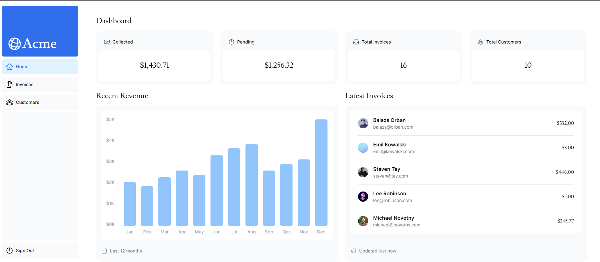

# Invoice Dashboard with Next.js


This is a simple web application built with Next.js that provides a dashboard for managing invoices. It allows authorised users to create, delete, and edit invoices. Stats regarding amount collected, amount pending etc. are also displayed. Latest invoices are also shown

## Features

- **Dashboard Overview**: View a summary of all invoices.
- **Create Invoice**: Add a new invoice with details such as client name, amount and status
- **Edit Invoice**: Modify existing invoice details.
- **Delete Invoice**: Remove an invoice from the dashboard.

## Getting Started

Follow these steps to run the project locally:

1. Clone this repository to your local machine:

   ```bash
   git clone https://github.com/deepesh1793/Dashboard.git
   ```

2. Navigate to the project directory:

   ```bash
   cd nextjs-invoice-dashboard
   ```

3. Install dependencies:

   ```bash
   npm install
   ```

4. Start the development server:

   ```bash
   npm run dev
   ```

5. Open your web browser and visit http://localhost:3000 to view the application.
